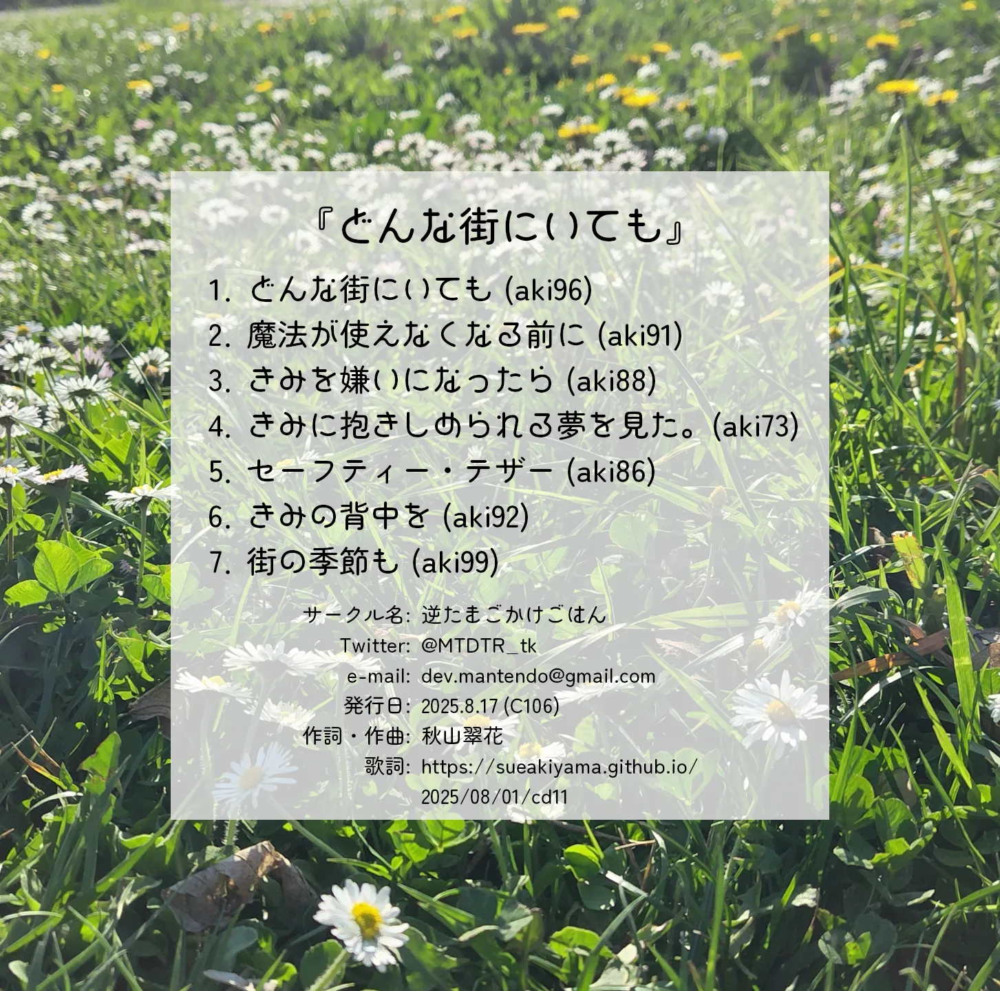

CDリスト建設予定地

# このページは整備中です!

<h2 id="おしながき">CD一覧</h2>


  
    
    TEST
<!--    

        <h3 id="{{ doc.title }}">{{ doc.title }}</h3>
        

            

                <input type="radio" name="cd_select" id="cd_jacket_a" class="non" checked>
                <input type="radio" name="cd_select" id="cd_jacket_b" class="non">
                <input type="radio" name="cd_select" id="cd_jacket_c" class="non">
                
                
                
            

            <table class="cds-float-right">
                <thead>
                    <tr>
                        <th>タイトル</th>
                        <th>{{ doc.title }}</th>
                    </tr>
                </thead>
                <tbody>
                    <tr>
                        <td>画像</td>
                        <td>
                            <label for="cd_jacket_a"><a>ジャケット表面</a></label>・
                            <label for="cd_jacket_b"><a>ジャケット裏面</a></label>・
                            <label for="cd_jacket_c"><a>レーベル</a></label>
                        </td>
                    </tr>
                    <tr>
                        <td>価格</td>
                        <td>{{ doc.price }}</td>
                    </tr>
                    <tr>
                        <td>収録曲</td>
                        <td>{{ doc.songs }}</td>
                    </tr>
                    <tr>
                        <td>初出</td>
                        <td>{{ doc.firstEvent }}</td>
                    </tr>
                    <tr>
                        <td>コメント</td>
                        <td>{{ doc.comment }}</td>
                    </tr>
                    <tr>
                        <td>在庫</td>
                        <td>
                          
                          DL版のみ
                          
                          在庫あり
                          
                        </td>
                    </tr>
                  <tr>
                      <td>XFD</td>
                      <td><a href="https://nico.ms/{{ doc.xfd }}" target="_blank">{{ doc.xfd }}</a></td>
                  </tr>
                </tbody>
            </table>
        

        
-->
    

  

<h3 id="どんな街にいても">どんな街にいても</h3>

    

        <input type="radio" name="cd10_select" id="cd10_jacket_a" class="non" checked>
        <input type="radio" name="cd10_select" id="cd10_jacket_b" class="non">
        <input type="radio" name="cd10_select" id="cd10_jacket_c" class="non">
        
        
        
    

    <table class="cds-float-right">
        <thead>
            <tr>
                <th>タイトル</th>
                <th>どんな街にいても</th>
            </tr>
        </thead>
        <tbody>
            <tr>
                <td>画像</td>
                <td>
                    <label for="cd10_jacket_a"><a>ジャケット表面</a></label>・
                    <label for="cd10_jacket_b"><a>ジャケット裏面</a></label>・
                    <label for="cd10_jacket_c"><a>レーベル</a></label>
                </td>
            </tr>
            <tr>
                <td>価格</td>
                <td>1000円</td>
            </tr>
            <tr>
                <td>収録曲</td>
                <td>
                </td>
            </tr>
            <tr>
                <td>初出</td>
                <td><b>新譜</b></td>
            </tr>
            <tr>
                <td>コメント</td>
                <td>おひさしぶりのアルバムです。留学中に寂しくなって書いた曲が多い気がします。</td>
            </tr>
            <tr>
                <td>XFD</td>
                <td>
                </td>
            </tr>
        </tbody>
    </table>

<!-- Auto-List Test -->

  

  
    
      

         
        <h2 class="float-right" style="font-size:26px;">{{ doc.title }}</h2>
        <table class="float-right">
          <tr>
            <th>ID</th>
            <td>{{ doc.name | remove: '.md' }}</td>
          </tr>
          <tr>
            <th>作曲年</th>
            <td>{{ doc.postTime }}</td>
          </tr>
          <tr>
            <th>ニコニコ</th>
            <td><a href="https://www.nicovideo.jp/watch/{{ doc.nicoId }}" target="_blank">{{ doc.nicoId }}</a></td>
          </tr>
          <tr>
            <th>歌詞</th>
            <td>{{ doc.lyric }}</td>
          </tr>
          <tr>
            <th>収録CD</th>
            <td style="font-size:15px;">{{ doc.songIn }}</td>
          </tr>
            <tr>
                <td>画像</td>
                <td>
                    <label for="cd10_jacket_a"><a>ジャケット表面</a></label>・
                    <label for="cd10_jacket_b"><a>ジャケット裏面</a></label>・
                    <label for="cd10_jacket_c"><a>レーベル</a></label>
                </td>
            </tr>
        </table>
      

    
  

<!-- Auto-List Test End -->
