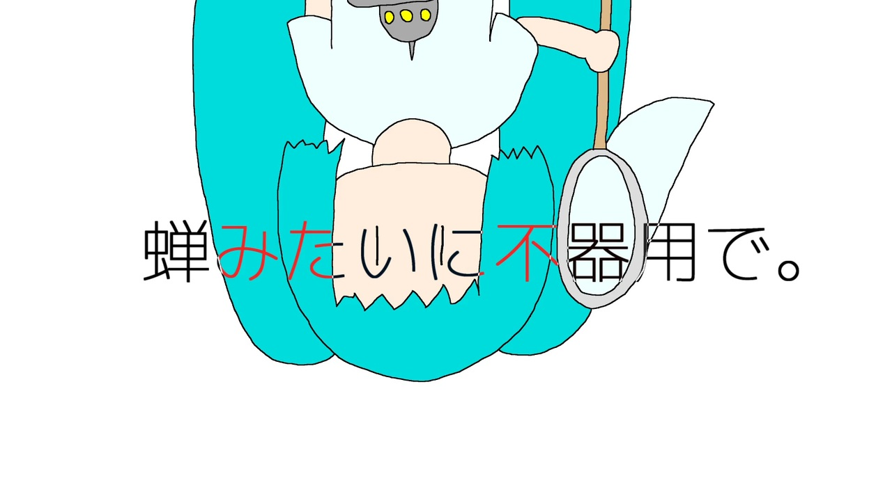

## 基本データ

<table class="float-left">
  <tr>
    <td>ID</td>
    <td>aki44</td>
  </tr>
  <tr>
    <td>作曲年</td>
    <td>2022年9月</td>
  </tr>
  <tr>
    <td>ニコニコ</td>
    <td><a href="https://nico.ms/sm41110114">sm41110114</a></td>
  </tr>
  <tr>
    <td>歌詞</td>
    <td>日に焼けたアスファルトのにおいと……</td>
  </tr>
  <tr>
    <td>収録CD</td>
    <td>逆たまごかけごはん</td>
  </tr>
</table>

## 歌詞

日に焼けたアスファルトのにおいと、  
目を焼くような黄緑色が、  
ぼくに季節を思い出させたんだ。  
耳に残る蝉のじりりと、  
自転車のサドル照らす太陽は、  
まぎれもない夏のシンボル。

蝉と蝉の死体って、おんなじ季節の季語なんだって、  
きみが教えてくれたんだっけ?  
苦しいねつらいねって真面目そうに呟いてみせるきみが、  
なんだか可笑しかったな。だって、

蝉みたいに不器用で、  
蝉みたいに向こう見ずで、  
蝉みたいにちょっとしか  
生きられなさそうなきみが、  
そんなこと言うなんてさ。

きみみたいな無粋なやつに  
そんな言葉は似合わないなんてさ、  
けっして思っちゃいないんだ。だけど  
苦しいねつらいねって、  
本当に思ってるのは僕だって  
言いかけた、口をつぐんだ。

感情のたとえとか、  
季節感の添え物に  
きみがなっちゃうのが怖くて、  
どうしようもないんだ。  
こんなこと、笑われるかな。

蝉みたいに不器用で、  
蝉みたいに向こう見ずで、  
蝉みたいにちょっとしか  
生きられなさそうなきみが、  
そんなこと言うなんてさ。

## 試聴

feat. 初音ミク  
<noscript><a href="https://www.nicovideo.jp/watch/sm41110114">[ミクオリジナル] 蝉みたいに不器用で。 (aki44)</a></noscript>

## オフボーカル

<a href="https://piapro.jp/t/yzQh">Piapro</a>
