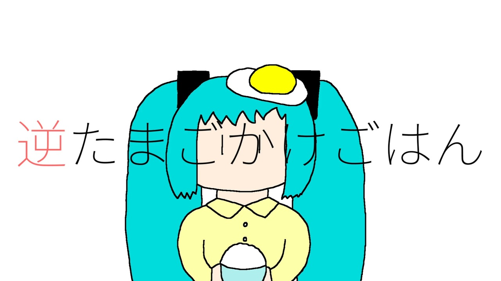

## 基本データ

<table class="float-left">
  <tr>
    <td>ID</td>
    <td>aki47</td>
  </tr>
  <tr>
    <td>作曲年</td>
    <td>2022年10月</td>
  </tr>
  <tr>
    <td>ニコニコ</td>
    <td>sm00000</td>
  </tr>
  <tr>
    <td>歌詞</td>
    <td>割れたたまごが元には戻らないように……</td>
  </tr>
  <tr>
    <td>収録CD</td>
    <td>逆たまごかけごはん</td>
  </tr>
</table>

## 歌詞

割れたたまごがもとには戻らないように、  
大人はもう子どもに戻れないらしい。  
たまごを割りながら誕生日を数えて、  
ひとりで勝手に苦しくなってるだけかもしれないけど。

ぼくの身体も、ぼくの心も、  
不可逆的な成長に屈したくはない。   
割れないことも割れることもできる、   
完璧な殻の中で生きていたい。  

たまごとご飯をぐるぐると混ぜて、   
均一なパステルカラーにしよう。  
目にはやさしいけどなんとなく退屈で、  
それからちょっとだけグロテスクな気がしたんだ。 

ぼくの身体も、ぼくの心も、  
ぼくだけのものであってほしくて。  
標準的であまりにも平凡な、  
おなじ顔の大人になんてなりたくない。 

たまごかけごはんを逆回しする、  
みたいに大人も巻き戻せたらいいのにな。  
ばらばらになったたまごの殻ひとつずつ、  
目と鼻を描きこみながら考えていた。 
