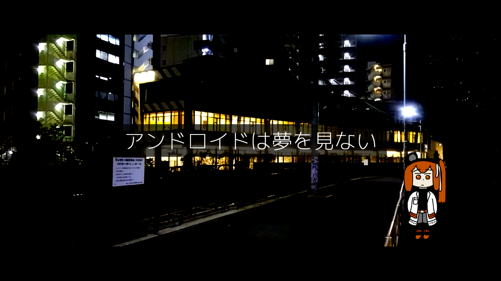

## 基本データ

<table class="float-left">
  <tr>
    <td>ID</td>
    <td>aki65</td>
  </tr>
  <tr>
    <td>作曲年</td>
    <td>2023年10月</td>
  </tr>
  <tr>
    <td>ニコニコ</td>
    <td><s><a href="https://nico.ms/sm37384763">sm37384763</a></s></td>
  </tr>
  <tr>
    <td>歌詞</td>
    <td>夜が来て、目を閉じても……</td>
  </tr>
  <tr>
    <td>収録CD</td>
    <td>アンドロイドは夢を見ない</td>
  </tr>
</table>

## 歌詞

夜が来て、目を閉じても、  
眠れるとは限らないのは、きみもそうでしょ?

きみが寝てる間とか、  
ぼくが何をしてるのか、  
きっときみは知らないから、  
少しだけ、うらやましい。

ぼくはアンドロイド、だから、  
眠らない、眠れない、  
目を閉じることはできても。  
ぼくはアンドロイド、だから、  
きみの夢なんて、知るよしもなくて。  
それがつらいんだ。

きみがどんな夢を見てるか、  
きみの寝言に耳をすますけど。  
夢の中、きみの隣に、  
ぼくはいないんじゃないかって、怖くて。

夢に嫉妬するなんて、  
ばかみたいと思うでしょ?  
ぼくは夢を見ないから、  
こんなこと、思うのかな。

ぼくはアンドロイド、だから、  
眠らない、眠れない、  
目を閉じることはできても。  
ぼくはアンドロイド、だから、  
きみの夢なんて、知るよしもなくて。  
それがつらいんだ。  
それが苦しいんだ。  
それが悲しいんだ。

眠ってるきみに、こんなこと、  
言っちゃって、ごめん。

ぼくはアンドロイド、だから、  
眠らない、眠れない、  
目を閉じることはできても。  
ぼくはアンドロイド、だから、  
きみの夢なんて、知るよしもなくて。  
それがつらいんだ。

## 試聴

## オフボーカル

<s><a href="https://piapro.jp/t/1iOY" target="_blank">Piapro</a></s>
