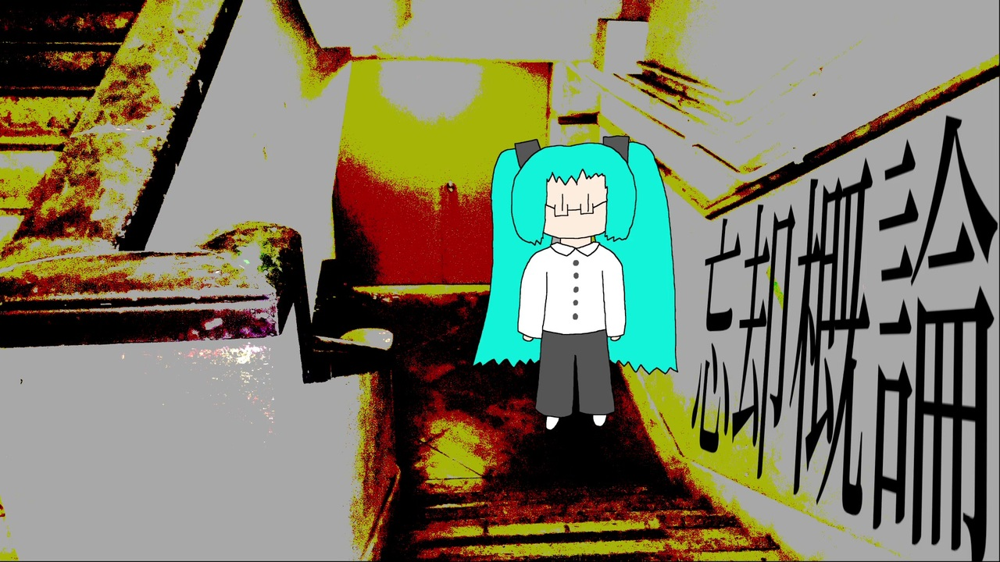
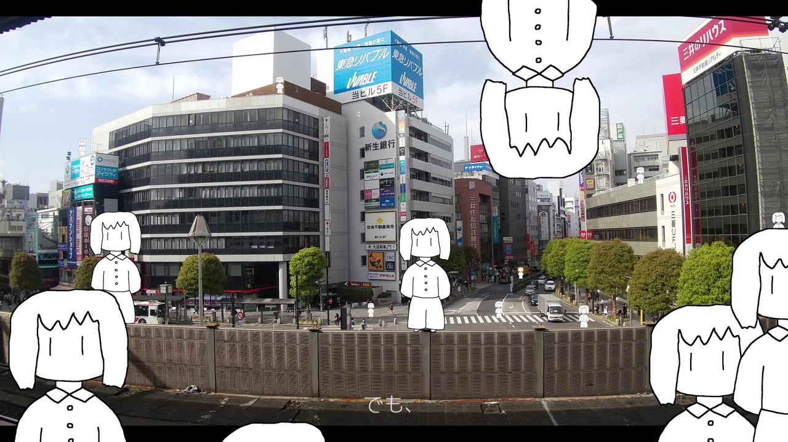
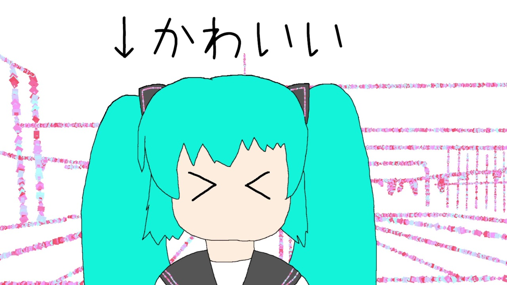

<!-- Auto-List Test -->

  

  
    
      

         
        <h2 class="float-right" style="font-size:26px;">{{ doc.title }}</h2>
        <table class="float-right">
          <tr>
            <th>ID</th>
            <td>{{ doc.name | remove: '.md' }}</td>
          </tr>
          <tr>
            <th>作曲年</th>
            <td>{{ doc.postTime }}</td>
          </tr>
          <tr>
            <th>ニコニコ</th>
            <td><a href="https://www.nicovideo.jp/watch/{{ doc.nicoId }}">{{ doc.nicoId }}</a></td>
          </tr>
          <tr>
            <th>歌詞</th>
            <td>{{ doc.lyric }}</td>
          </tr>
          <tr>
            <th>収録CD</th>
            <td style="font-size:15px;">{{ doc.songIn }}</td>
          </tr>
        </table>
      

    
  

<!-- Auto-List Test End -->

  

     
    <h2 class="float-right" style="font-size:26px;">アンドロイドは夢を見ない</h2>
    <table class="float-right">
      <tr>
        <th>ID</th>
        <td>aki65</td>
      </tr>
      <tr>
        <th>作曲年</th>
        <td>2023年10月</td>
      </tr>
      <tr>
        <th>ニコニコ</th>
        <td><a href="https://www.nicovideo.jp/watch/sm43048884">sm43048884</a></td>
      </tr>
      <tr>
        <th>歌詞</th>
        <td>夜が来て、目を閉じても……</td>
      </tr>
      <tr>
        <th>収録CD</th>
        <td style="font-size:15px;">アンドロイドは夢を見ない</td>
      </tr>
    </table>
  

  

     
    <h2 class="float-right">春休み2週間目</h2>
    <table class="float-right">
      <tr>
        <th>ID</th>
        <td>aki54</td>
      </tr>
      <tr>
        <th>作曲年</th>
        <td>2023年2月</td>
      </tr>
      <tr>
        <th>ニコニコ</th>
        <td><a href="https://www.nicovideo.jp/watch/sm41805954">sm41805954</a></td>
      </tr>
      <tr>
        <th>歌詞</th>
        <td>春休み2週間目 やりたいこと……</td>
      </tr>
      <tr>
        <th>収録CD</th>
        <td>100年寝たい</td>
      </tr>
    </table>
  

  

     
    <h2 class="float-right">セカンドハンド・ ラブストーリー</h2>
    <table class="float-right">
      <tr>
        <th>ID</th>
        <td>aki51</td>
      </tr>
      <tr>
        <th>作曲年</th>
        <td>2022年12月</td>
      </tr>
      <tr>
        <th>ニコニコ</th>
        <td>なし</td>
      </tr>
      <tr>
        <th>歌詞</th>
        <td>「すき」とか「愛してる」とか……</td>
      </tr>
      <tr>
        <th>収録CD</th>
        <td>逆たまごかけごはん</td>
      </tr>
    </table>
  

  

     
    <h2 class="float-right">逆たまごかけごはん</h2>
    <table class="float-right">
      <tr>
        <th>ID</th>
        <td>aki47</td>
      </tr>
      <tr>
        <th>作曲年</th>
        <td>2022年10月</td>
      </tr>
      <tr>
        <th>ニコニコ</th>
        <td><a href="https://nico.ms/sm41194270">sm41194270</a></td>
      </tr>
      <tr>
        <th>歌詞</th>
        <td>割れたたまごが元には戻らないように……</td>
      </tr>
      <tr>
        <th>収録CD</th>
        <td>逆たまごかけごはん</td>
      </tr>
    </table>
  

  

     
    <h2 class="float-right">蝉みたいに不器用で。</h2>
    <table class="float-right">
      <tr>
        <th>ID</th>
        <td>aki44</td>
      </tr>
      <tr>
        <th>作曲年</th>
        <td>2022年9月</td>
      </tr>
      <tr>
        <th>ニコニコ</th>
        <td><a href="https://nico.ms/sm41110114">sm41110114</a></td>
      </tr>
      <tr>
        <th>歌詞</th>
        <td>日に焼けたアスファルトのにおいと……</td>
      </tr>
      <tr>
        <th>収録CD</th>
        <td>逆たまごかけごはん</td>
      </tr>
    </table>
  

  

     
    <h2 class="float-right">忘却概論</h2>
    <table class="float-right">
      <tr>
        <th>ID</th>
        <td>aki36</td>
      </tr>
      <tr>
        <th>作曲年</th>
        <td>2021年7月</td>
      </tr>
      <tr>
        <th>ニコニコ</th>
        <td><a href="https://nico.ms/sm39170091">sm39170091</a></td>
      </tr>
      <tr>
        <th>歌詞</th>
        <td>ひとの名前は覚えない……</td>
      </tr>
      <tr>
        <th>収録CD</th>
        <td>逆たまごかけごはん</td>
      </tr>
    </table>
  

  

     
    <h2 class="float-right">サイダーブルー</h2>
    <table class="float-right">
      <tr>
        <th>ID</th>
        <td>aki32</td>
      </tr>
      <tr>
        <th>作曲年</th>
        <td>2021年4月</td>
      </tr>
      <tr>
        <th>ニコニコ</th>
        <td><a href="https://nico.ms/sm39170091">sm39170091</a></td>
      </tr>
      <tr>
        <th>歌詞</th>
        <td>詩を書くのは得意じゃなくて……</td>
      </tr>
      <tr>
        <th>収録CD</th>
        <td>逆たまごかけごはん</td>
      </tr>
    </table>
  

  

     
    <h2 class="float-right">エリアメール変奏曲</h2>
    <table class="float-right">
      <tr>
        <th>ID</th>
        <td>aki27</td>
      </tr>
      <tr>
        <th>作曲年</th>
        <td>2020年10月</td>
      </tr>
      <tr>
        <th>ニコニコ</th>
        <td><a href="https://nico.ms/sm38712935">sm38712935</a></td>
      </tr>
      <tr>
        <th>歌詞</th>
        <td>ああ、聞こえない、しどけない……</td>
      </tr>
      <tr>
        <th>収録CD</th>
        <td>逆たまごかけごはん</td>
      </tr>
    </table>
  

  

     
    <h2 class="float-right">日常系ヒゲンジツ</h2>
    <table class="float-right">
      <tr>
        <th>ID</th>
        <td>aki26</td>
      </tr>
      <tr>
        <th>作曲年</th>
        <td>2020年8月</td>
      </tr>
      <tr>
        <th>ニコニコ</th>
        <td><a href="https://nico.ms/sm37384763">sm37384763</a></td>
      </tr>
      <tr>
        <th>歌詞</th>
        <td>将来の夢も展望も……</td>
      </tr>
      <tr>
        <th>収録CD</th>
        <td>逆たまごかけごはん</td>
      </tr>
    </table>
  

